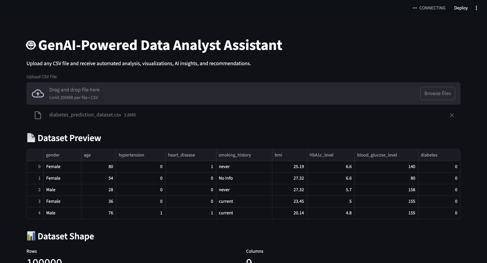

# 🤖 GenAI-Powered Data Analyst Assistant

An AI-powered analytics application that automates exploratory data analysis (EDA), data quality assessment, visualization, and business insight generation — combining classic data science workflows with Google Gemini for natural-language summarization and Q&A.


## Application Demo



## How it works
1. Upload a CSV file through the Streamlit interface.
2. Automated EDA runs immediately: shape, dtypes, missing values, duplicate counts, a data health score, descriptive statistics, histograms, box plots, and a correlation heatmap.
3. AI Dataset Summary — on request, a sample of the dataset (df.head(20)) is passed to Gemini (gemini-2.5-flash), prompted to return a structured overview: dataset overview, key trends, data quality issues, business recommendations, and notable insights.
4. Natural Language Q&A — users can ask free-form questions about their data; a larger sample (df.head(50)) plus the question is sent to Gemini, which answers grounded in the actual uploaded data rather than a generic response.
5. Download Report — exports the full descriptive statistics table as a CSV.


This keeps the AI grounded in the user's real data (not just general knowledge) while keeping API costs and latency low, since only a row sample — not the full dataset — is sent to Gemini.

## Features

- CSV Upload
- Missing Value Analysis
- Duplicate Detection
- Dataset Health Score
- Statistical Summary
- Correlation Heatmap
- AI Dataset Summary
- Natural Language Q&A
- Downloadable CSV Report

## Tech Stack

* Language: Python
* App framework: Streamlit
* Data processing: Pandas
* Visualization: Matplotlib, Seaborn
* GenAI: Google Gemini API (gemini-2.5-flash)

##Limitations & Notes

- Gemini responses are grounded on a row sample (first 20–50 rows), not the full dataset — this keeps prompts within context limits but means insights on very large or non-uniform datasets may not fully represent the whole file.
- Requires a Gemini API key (free tier is rate-limited; the app handles 429 errors gracefully).
- No persistence — analysis is per-session; nothing is saved server-side.


 Google Gemini API

## How to Run

```bash
pip install -r requirements.txt
streamlit run app.py
```
You'll need a GEMINI_API_KEY set in .streamlit/secrets.toml:

```bash
GEMINI_API_KEY = "your-key-here"
```

## Author

Keerthana Bellam
Master of Science in Data Science
Rowan University
